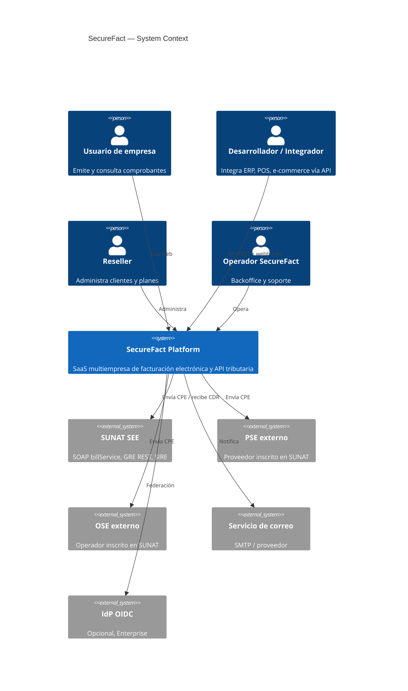
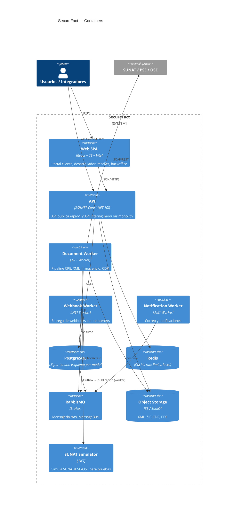
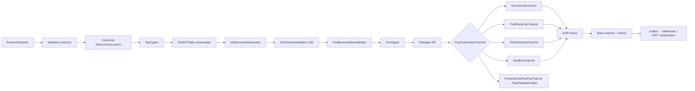
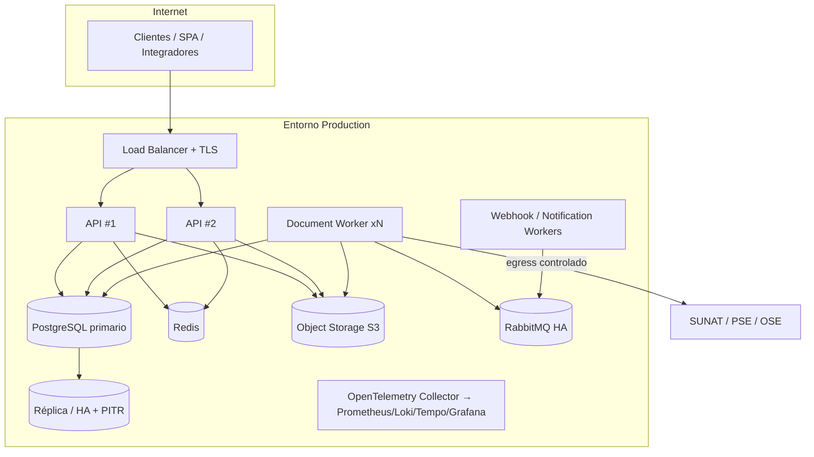

# Arquitectura C4

Diagramas en Mermaid (versionables). Nivel 1–3 + despliegue.

## 1. System Context

## 2. Containers

## 3. Components — ElectronicDocuments (pipeline CPE)

Módulos (cada uno con `Contracts` público): Identity, Tenancy, Organizations, Catalogs, Customers, Products, Billing, TaxEngine, ElectronicDocuments, Certificates, Sunat (adapters), Gre, Notifications, Webhooks, Developers, Subscriptions, Resellers, WhiteLabel, Audit, Reporting.

## 4. Deployment (objetivo; en MVP basta una instancia por servicio)

Entornos: Local (docker compose), Test, Staging, Production. Credenciales y certificados separados; la configuración por defecto de `Test` y `Local` solo admite `SandboxChannel` (ver ADR-006).
