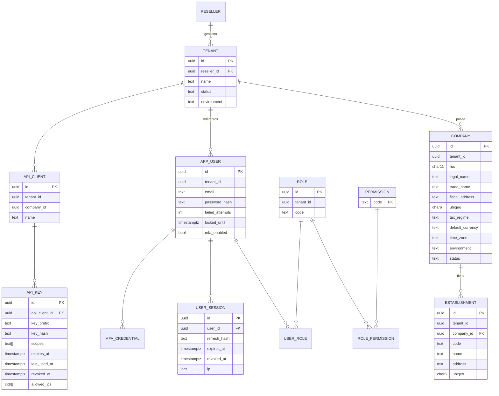
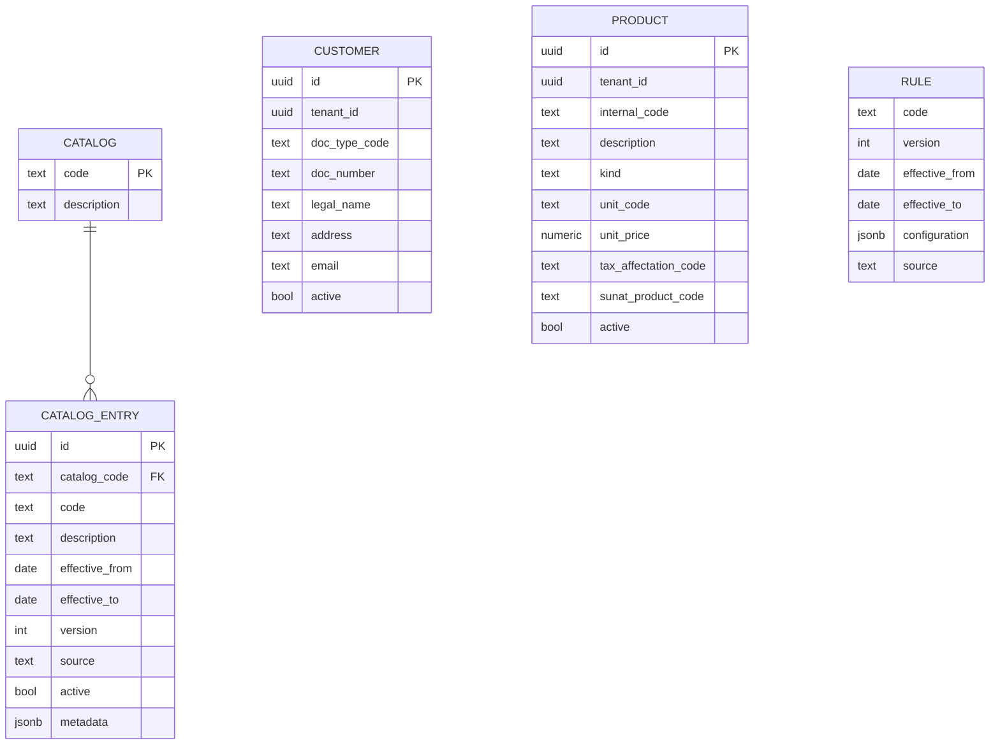
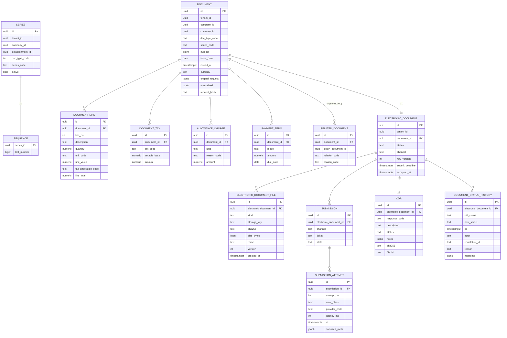
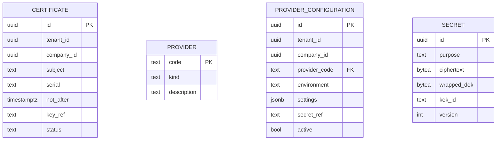
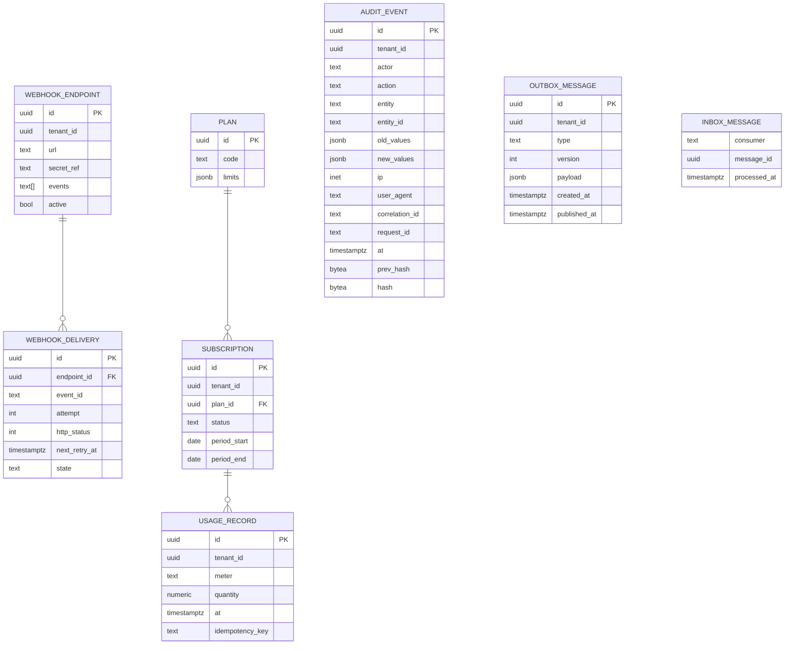

# ERD inicial

Principios:

- **Un esquema PostgreSQL por módulo** (`identity`, `tenancy`, `org`, `catalog`, `billing`, `cpe`, `cert`, `sunat`, `webhook`, `dev`, `sub`, `audit`, …). **Sin claves foráneas entre esquemas de módulos distintos**: se referencian por ID (GUID) y se validan por contrato.
- Toda tabla de negocio lleva `tenant_id uuid NOT NULL` y política **RLS** (ADR-003). Tablas de plataforma (catálogos globales, planes) no llevan `tenant_id`.
- Claves primarias `uuid` (v7, ordenables). Marcas de tiempo `timestamptz` en UTC; fechas tributarias `date` (campo `issue_date`) separadas de `issued_at`.
- Dinero: `numeric(18,4)` (precisión final la fija TaxEngine); porcentajes `numeric(9,6)`.
- Concurrencia optimista: columna `xmin`/`row_version` en agregados con estado.
- Tablas append-only (`audit.event`, `cpe.document_status_history`, `sub.usage_record`, `cpe.submission_attempt`) sin `UPDATE/DELETE` para el rol de aplicación.

## 1. Tenancy, organizaciones e identidad

Nota: `RESELLER` pertenece a la plataforma y no lleva `tenant_id`; un tenant apunta opcionalmente a su reseller. Los permisos del reseller sobre un tenant son explícitos (`reseller_grant`), nunca implícitos.

## 2. Catálogos, clientes y productos

## 3. Facturación y documento electrónico

Reglas de integridad clave:

- Unicidad `UNIQUE (tenant_id, company_id, doc_type_code, series_code, number)`.
- Idempotencia: tabla `api.idempotency_key (tenant_id, key, request_hash, response_ref, expires_at)` con `UNIQUE (tenant_id, key)`.
- `SEQUENCE` se incrementa con `UPDATE ... SET last_number = last_number + 1 ... RETURNING` dentro de la misma transacción que crea el documento (nunca `MAX()+1`).
- Un documento aceptado es inmutable: triggers/permiso impiden `UPDATE` de columnas fiscales y de `electronic_document_file`.
- `RELATED_DOCUMENT` impide notas huérfanas (`origin_document_id` obligatorio para NC/ND).

## 4. Certificados, canales y secretos

`key_ref` y `secret_ref` apuntan a `SECRET` (cifrado de envoltura: DEK por secreto cifrada con KEK; ADR-007). Los PFX y claves SOL nunca se guardan en claro ni en columnas legibles.

## 5. Webhooks, API, suscripciones, auditoría

`AUDIT_EVENT` es append-only con cadena de hashes (`prev_hash → hash`) para detectar manipulación. `OUTBOX_MESSAGE` vive en el esquema de cada módulo que publica; `INBOX_MESSAGE` garantiza idempotencia de consumidores.

## 6. Entidades futuras (no se modelan aún)

`SUPPLIER`, `GRE_*` (guías, vehículos, conductores), `WITHHOLDING_*`, `PERCEPTION_*`, `TAX_BOOK_*` (SIRE), `FACTORING_*`. Se diseñan al iniciar sus fases, tras revisar la fuente oficial correspondiente.
